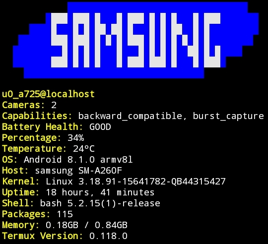

# termux-fetch
A small bash script that gives info about your device

### instalation
- Before anything, you should clone this repository
```git clone https://github.com/noobjsperson/termux-fetch```
1. Now you could install the provided deb file with
```apt install ./nameofdeb.deb```

2. Or you could package the deb manually following the next steps:
- Install `termux-create-package` with 
```pkg install termux-create-package```
- Execute the following command
```termux-create-package manifest.json```
- Install the resulting deb file
```apt install ./nameofdeb.deb```
